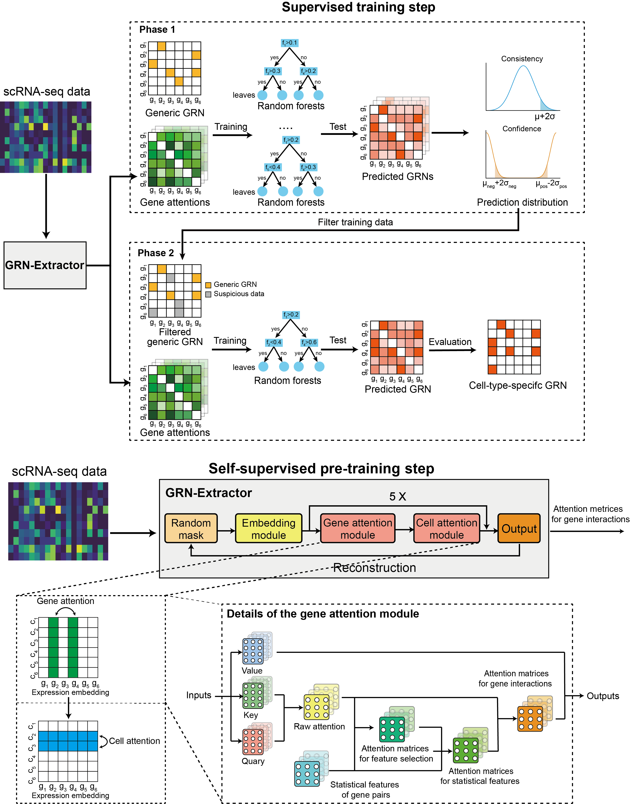

# GRN-Transformer

## About
This directory contains the code and resources of the following paper:
<i> Boosting single-cell gene regulatory network reconstruction via bulk-cell transcriptomic data </i>

## Overview of the Model

<p align="center">
 
</p>

## Dependencies
- python==3.7
- einops==0.3.0
- pytorch==1.7.0+cu101
- pandas==1.1.4
- numpy==1.19.4
- scikit-learn==0.23.2
- argparse==1.4.0

All dependencies can be installed within a few minutes.

## Description of directories and files
- [src] contains the detailed implementation for the self-supervised step of the GRN-Transformer
- [demo_data] contains the example of the used dataset.
    - BEELINE
        - 500_ChIP-seq_mDC
            - inputs:
                - Including the gene expression data 'data.csv' (cells in columns and genes in rows),
                - ground truth cell-type-specific GRN 'label.csv' (two columns, TF names and target names), 
                - GRN inference result by using PIDC 'PIDC_output_file.txt'
                - train-test-split index files 'split_non_*.pkl'(two list, first list is the training index and second list is the test index) 
                - TF-target names 'train_z.npy' (two columns, TF names and target names)
                - ground truth cell-type-specific GRN labels 'train_y.npy' (1 is for edge in cell-type-specific GRN while 0 is for edge not in cell-type-specific GRN, generated from label.csv)
                - cell-type-non-specific ChIP-seq training labels 'train_y_non.npy'(1 is for edge in non-specific GRN while 0 is for edge not in non-specific GRN, generated from other_data/human_Non-specific-ChIP-seq-network.csv (for hESC and hHep) and other_data/mouse_Non-Specific-ChIP-seq-network.csv (for mHSC, mESC, mDC))
            - outputs: 
                - Including example pretrain result 'pretrain_output.pkl' by running code self_supervised_main.py 
                - example performance output file 'performance.pkl' by running code supervised_main.py
        - other_data Including TFs and cell-type-non-specific GRN collected by BEELINE benchmark.
    - Simulation 
        - ER/SF
            - inputs:  Similar with inputs directory of 500_ChIP-seq_mDC except train-test-split index files. 
            'split\_\*\_0.5.pkl' denotes to the split file for train-test-split. 
            - outputs: Similar with outputs directory of 500_ChIP-seq_mDC 

- [self_superivsed_main.py]  The main function for the self-supervised learning step.

- [supervised_main.py] The main function for the supervised learning step.

## Usage
We take 500_ChIP-seq_mDC data as an example.

- self-supervised step
    ```sh
    python self_superivsed_main.py --data_file ./demo_data/BEELINE/500_ChIP-seq_mDC/inputs/data.csv --PIDC_file  
    ./demo_data/BEELINE/500_ChIP-seq_mDC/inputs/PIDC_output_file.txt --save_name pretrain_output --attention conventional_attention
    ```
    where '--data_file' denotes the input expression data (cells in rows and genes in columns), \
    '--PIDC_file' denotes the input pre-calculated PIDC file (three columns (TF name, Target gene name, and importance values), \
    '--attention' denotes the attention mechanism (selection from conventional_attention, efficient_attention, performer, reformer}), \
    '--save_name' denotes the output filename used in the following supervised step.
    
    We recommend using conventional_attention when the number of genes is not too large (e.g., less than 2000 for 
    GTX1080 Ti). Please run self_superivsed_main.py with GPU.
    It should be finished within 6 hours for the given demo dataset.  
    
- supervised step 
    ```sh
    python supervised_main.py --split_file split_non_1.pkl  --pre_GRN_file  
    ./demo_data/BEELINE/500_ChIP-seq_mDC/outputs/pretrain_output.pkl  --data_dir 
    ./demo_data/BEELINE/500_ChIP-seq_mDC/inputs/ --train_y_file  train_y_non.npy --output_file 
    ./demo_data/BEELINE/500_ChIP-seq_mDC/outputs/performance.pkl
    ```
  where '--pre_GRN_file' denotes the output file of the previous self-supervised step,
  '--data_dir' denotes the directory which includes all training data,\
  '--train_y_file' denotes the name of the training label file,\
  and '--output_file' denotes the output file name.\
  It should be finished in several minutes 
for the given demo dataset. 
If you have any questions, please feel free to contact me. \
Email: sht18@mails.tsinghua.edu.cn, shuht96@gmail.com
 
 # Other baseline single-cell RNA-seq package 
 - BEELINE https://github.com/Murali-group/Beeline
 - CNNC https://github.com/xiaoyeye/CNNC
 - DeepDRIM https://github.com/jiaxchen2-c/DeepDRIM
